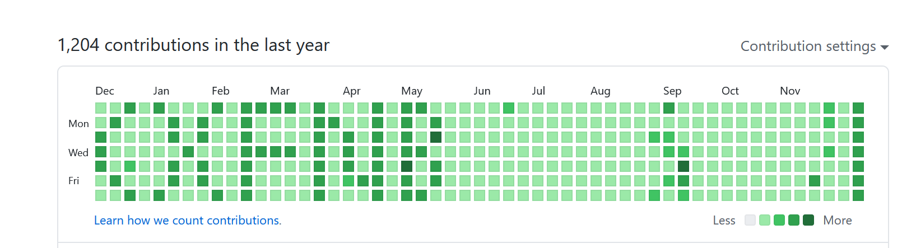

# commit-wall-painter

Paint Your Github Commit Wall into ASCII Art!

将你的 Github Commit 墙制作成 ASCII 艺术画！

## Usage（使用方法）

1. Modify the `text` string in `asciiArtGithub.py`.

- 将 `asciiArtGithub.py` 中的 `text` 字符串改为你想要的字符。

2. Run `asciiArtGithub.py` to render your text into Python lists.

- 运行 `asciiArtGithub.py`，将你的字符输出为 Python 列表。

3. Paste Python lists into `MyExpectedWall` in `MyCommitWallPainter.py`.

- 将 Python 列表粘贴到 `MyCommitWallPainter.py` 的 `MyExpectedWall` 中。

4. Run `MyCommitWallPainter.py` to generate a local git repository.

- 运行 `MyCommitWallPainter.py`，在本地生成 Git 仓库。

5. Push your repository to GitHub (if you do not know how to push your repository, you may want to download the [GitHub Desktop](https://desktop.github.com/)).

- 将本地 Git 仓库推送到 Github 上（如果你不知道如何推送仓库，可以下载 [GitHub Desktop](https://desktop.github.com/)）。

You may refer to the comments in source codes for more detailed information.

请参考源代码中的注释以获取更详细的信息。

## Example（示例）

## Author（作者）

`asciiArtGithub.py` is authored by [LeeJAJA](https://github.com/LeeJAJA) and Thanks for [Major-333](https://github.com/Major-333) for providing the idea.

`asciiArtGithub.py` 的作者是 [LeeJAJA](https://github.com/LeeJAJA)，此外还要感谢 [Major-333](https://github.com/Major-333) 提供的点子。